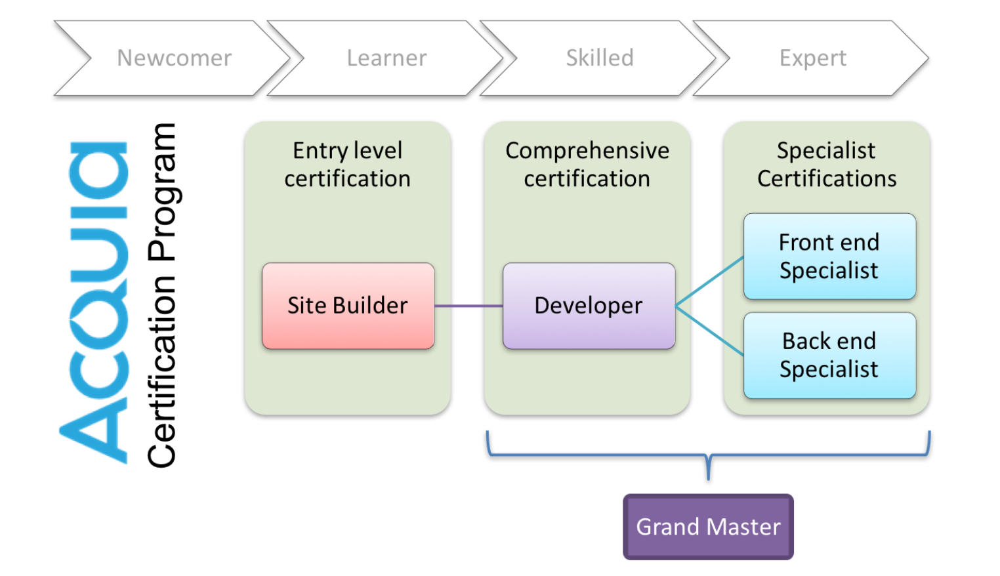

# About Acquia Certification Program

## What is Acquia Certification?

The [Acquia Certification Program](https://www.acquia.com/customer-success/learning-services/acquia-certification-program-overview) validates skills and knowledge of professionals building solutions with Drupal, Site Studio, and on the Acquia Platform. The program is a comprehensive series of examinations and credentials useful to individuals and organizations to demonstrate their expertise.

Thousands of developers from around the world have participated in the program since its launch in 2014.

## Why Acquia Certification?

The key benefits of the program for **individuals** are:

* **Validates** your skills and knowledge
* Establishes your **Credibility** and expertise with your peers
* Gives you more **Visibility** within the marketplace
* Provides you with a **Formal** certification

The key benefits for **organizations** building Site Studio solutions are:

* **Helps you hire** Drupal/Site Studio expertise
* **Differentiates** you in a crowded marketplace of solution providers
* Provides a **framework for training and certification** of different Drupal/Site Studio team roles

## Drupal Certification Exams

Acquia offers technical Certification in Drupal 7 and Drupal 8, in four competencies each:

| Drupal 8 | Drupal 7 |
| :--- | :--- |
| [Acquia Certified Drupal 8 Site Builder](https://www.acquia.com/customer-success/learning-services/acquia-certified-drupal-8-site-builder-exam) | [Acquia Certified Drupal 7 Site Builder](https://www.acquia.com/customer-success/learning-services/acquia-certified-drupal-site-builder-exam-blueprint) |
| [Acquia Certified Drupal 8 Developer](https://www.acquia.com/customer-success/learning-services/acquia-certified-developer-drupal-8-exam-blueprint) | [Acquia Certified Drupal 7 Developer](https://www.acquia.com/customer-success/learning-services/acquia-certified-developer-exam-blueprint) |
| [Acquia Certified Drupal 8 Front end Specialist](https://www.acquia.com/customer-success/learning-services/acquia-certified-developer-drupal-8-frontend-specialist) | [Acquia Certified Drupal 7 Front end Specialist](https://www.acquia.com/customer-success/learning-services/acquia-certified-developer-front-end-specialist-exam-blueprint) |
| [Acquia Certified Drupal 8 Back end Specialist](https://www.acquia.com/customer-success/learning-services/acquia-certified-back-end-specialist-d8-exam-blueprint) | [Acquia Certified Drupal 7 Back end Specialist](https://www.acquia.com/customer-success/learning-services/acquia-certified-developer-back-end-specialist-exam-blueprint) |

### Drupal Certification Path

This diagram shows the recommended progression through exams depending on the level of Drupal experience.

### Drupal Grand Master Certification

Developers who earn Certified Developer, Certified Front End Specialist, and Certified Back End Specialist \(Drupal 7 or Drupal 8 series\) _automatically_ earn the **Acquia Certified Drupal Grand Master** credential for that version of Drupal. There is _not_ a certification exam to obtain the Grand Master credential.

## Acquia Platform Certification Exams

Acquia provides customers and partners with a valuable, cloud-based platform that enhances the speed, agility, and reliability of delivery of Drupal applications. Acquia Cloud, Acquia Cloud Site Factory, and Acquia Lift are some components of the Acquia Platform.

Certification Exams for Acquia Platform were launched in 2017.

| Acquia Platform |
| :--- |
| [Acquia Cloud Pro](https://www.acquia.com/customer-success/learning-services/acquia-certified-cloud-pro-exam-blueprint) |
| [Acquia Site Factory Pro](https://www.acquia.com/customer-success/learning-services/acquia-certified-acquia-certified-site-factory-pro-exam-blueprint) |
| [Acquia Lift Pro](https://www.acquia.com/solutions/customer-success/acquia-certification) |
| [Acquia Site Studio Site Builder ](https://www.acquia.com/solutions/customer-success/acquia-certification) |

Learn more about the Acquia Certification Program at [https://www.acquia.com/customer-success/learning-services/acquia-certification-program](https://www.acquia.com/customer-success/learning-services/acquia-certification-program)

