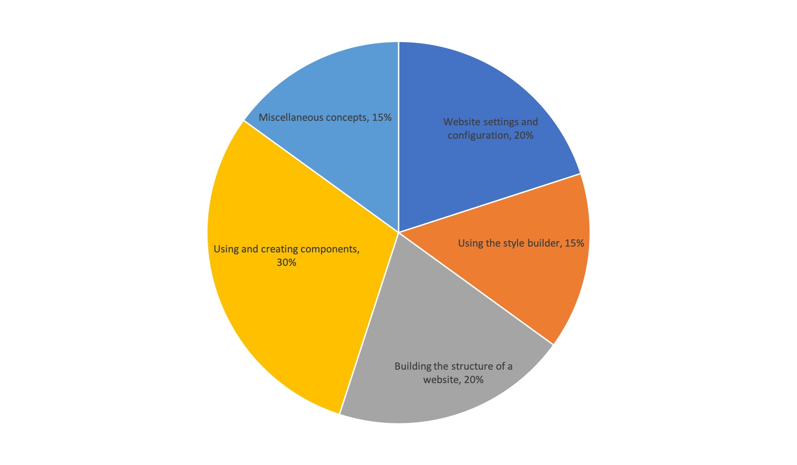

# Exam Domains

| \`Domain | % of Questions |
| :--- | ---: |
| 1.0 Website Settings and Configuration | 20% |
| 2.0 Using the Style Builder | 15% |
| 3.0 Building the Structure of a Site  | 20% |
| 4.0 Using and Creating Components | 30% |
| 5.0 Miscellaneous Concepts | 15% |
| **TOTAL** | **100%** |

**Note:** This exam blueprint includes topics, domains, and test objectives to help guide the test taker. It should not be construed as a comprehensive listing of all of the content of this examination.

### Exam Domains and Topics

|  | Topic |
| :--- | :--- |
|  **1** | **Website settings and configuration** |
| 1.1 | Understands the usage of Base unit size and unit conversion |
| 1.2 | Understands how to add colours to be used in their colour palette |
| 1.3 | Demonstrate an understanding on how to add fonts to their website |
| 1.4 | Demonstrate an understanding on how to add and use icon fonts |
| 1.5 | Demonstrate an understanding of how to set up and use the responsive grid settings |
| 1.6 | Demonstrate an understanding of SCSS variables and how to use them |
| **2** | **Using the style builder** |
| 2.1 | Demonstrate an ability to can create a base style that is utilised in the website |
| 2.2 | Demonstrate an ability to create a basic custom style with the interface |
| 2.3 | Demonstrate an ability to create advanced styles with the style tree |
| 2.4 | Demonstrate an ability to create responsive custoM styles by using the breakpoint selectors |
| **3** | **Building the structure of a website** |
| 3.1 | Demonstrate an ability to create and use Content Templates |
| 3.2 | Demonstrate an ability to create master templates |
| 3.3 | Demonstrate the ability to create View templates |
| 3.4 | Demonstrate the ability to use and create menu templates |
| **4** | **Using and creating components** |
| 4.1 | Demonstrate an ability to use the editing experience with components |
| 4.2 | Demonstrate an ability to create a component layout |
| 4.3 | Demonstrate an ability to create a component form |
| 4.4 | Demonstrate an understanding of creating advanced layout and style options |
| 4.5 | Demonstrate understanding of the usage of component dropzones |
| **5** | **Miscellaneous concepts** |
| 5.1 | Demonstrate an understanding of how and when to use 'hide if no data' |
| 5.2 | Demonstrate a knowledge of how to use an existing select field in components |
| 5.3 | Demonstrate an understanding of reusability across multiple Site Studio enabled websites |

Learn more about the Acquia Certification Program at [https://www.acquia.com/customer-success/learning-services/acquia-certification-program](https://www.acquia.com/customer-success/learning-services/acquia-certification-program)

