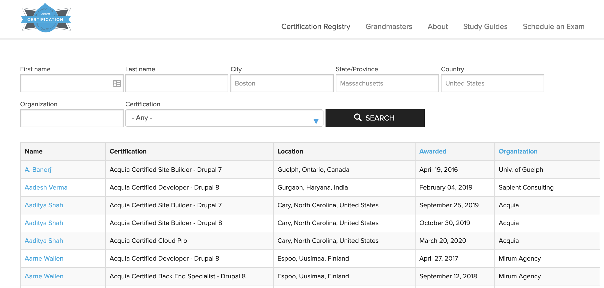

# Reporting and Registry

Once you have passed your Acquia Certified Site Studio Site Builder exam, you can shout it from the rooftops by adding your Acquia Certified badge in your CV, email signature, and LinkedIn profile.

You can confirm you are registered in Acquia’s Certification Registry by visiting [https://certification.acquia.com/registry](https://certification.acquia.com/registry) and searching for your name. Names appear in the registry approximately 48 hours after an exam is passed. 

Learn more about the Acquia Certification Program at [https://www.acquia.com/customer-success/learning-services/acquia-certification-program](https://www.acquia.com/customer-success/learning-services/acquia-certification-program)

